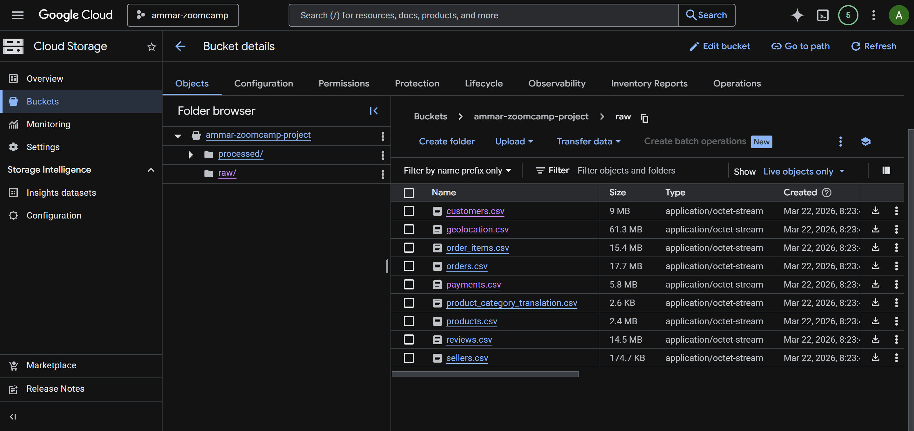
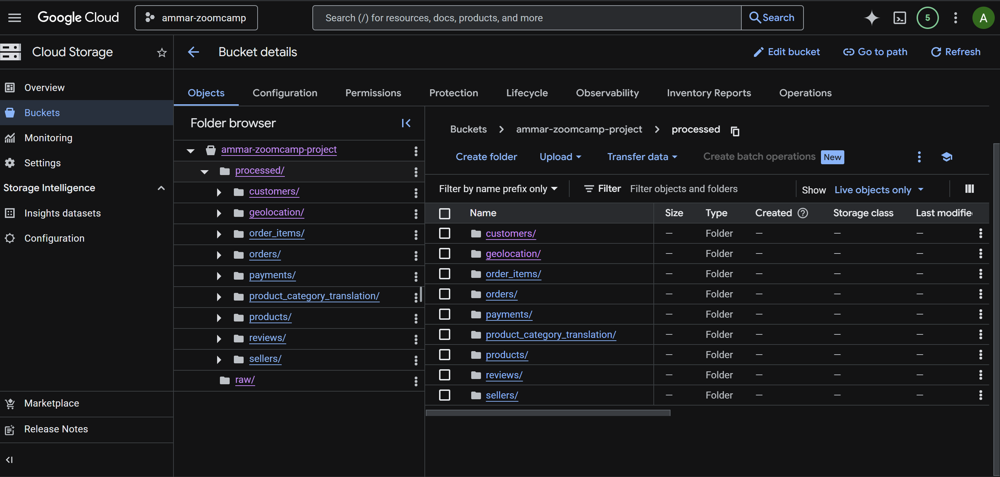
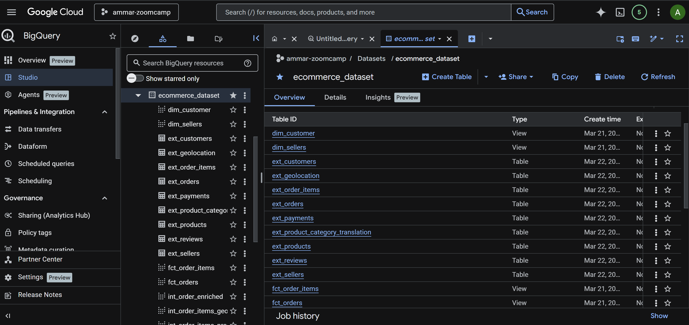
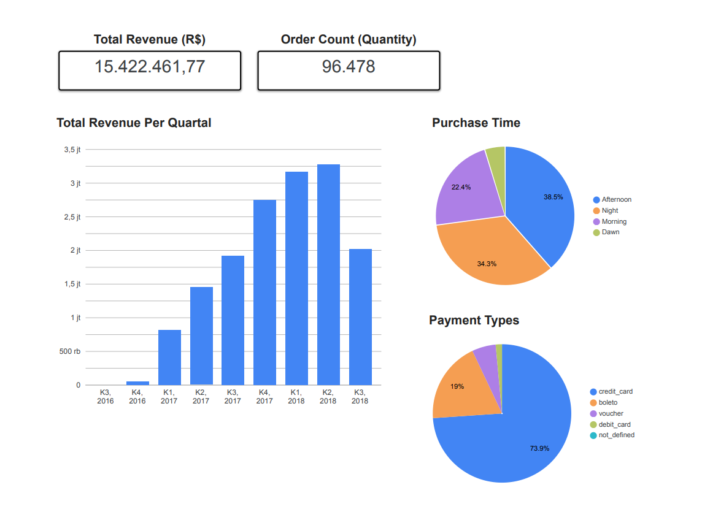

# Olist E-Commerce Analytics Pipeline (Zoomcamp-Project)

## Project Overview
This project builds an End-to-End Data Pipeline to analyze the Brazilian E-Commerce Public Dataset by Olist. The primary objective is to transform fragmented transactional data into a clean, performant Star Schema to provide actionable business insights regarding logistics efficiency, seller performance, and customer loyalty.

## Problem Statement
In the rapidly evolving e-commerce landscape, businesses struggle to gain a holistic view of their operations when data is siloed across multiple domains (customers, sellers, payments, and logistics). Specifically for Olist, a major Brazilian department store marketplace, there is a need to understand the relationship between geographic location, delivery performance, and customer satisfaction.

**The Challenge:**

Manual analysis of 100,000 orders across 2016–2018 is inefficient. Stakeholders need an automated, end-to-end pipeline that transforms raw transactional data into actionable insights.

**The Solution:**

This project builds a robust data platform to answer:

- Sales Trends: How do order volumes fluctuate over time across different Brazilian states?
- Logistics Efficiency: Which regions experience the highest freight costs versus delivery speeds?
- Customer Satisfaction: What is the distribution of review scores across the top product categories?

By implementing this pipeline, Olist can identify underperforming regions and optimize their logistics partnership network.

## Architecture & Technologies

- **Cloud Platform**: Google Cloud Platform (GCP)
- **Infrastructure as Code**: Terraform
- **Workflow Orchestration**: Kestra
- **Distributed Computing**: Apache Spark (Data Processing & Format Conversion)
- **Data Lake**: Google Cloud Storage (GCS)
- **Data Warehouse**: BigQuery
- **Transformation Layer**: dbt (Data Build Tool)
- **Visualization**: Looker Studio

## Project Structure

```bash
zoomcamp-project/
│
├── dbt/
│   ├── dbt-env/                     ← Virtual environment for dbt
│   ├── logs/                        ← Logs for dbt
│   ├── zoomcamp/
│   │   ├── analyses/                ← Analysis and reports
│   │   ├── dbt_packages/            ← Required dbt packages
│   │   ├── macros/                  ← SQL macros for dbt
│   │   ├── models/                  ← dbt models for staging, intermediate, and marts
│   │   │   ├── intermediate/        ← Intermediate data processing
│   │   │   ├── mart/                ← Data processing for marts (dimension, fact tables)
│   │   │   └── staging/             ← Staging tables for transforming raw data
│   │   ├── seeds/                   ← Data seeds for dbt
│   │   └── snapshots/               ← Snapshots for dbt
│   └── .env                         ← Environment variables for dbt
│
├── image/                           ← Folder for images or visual assets
├── keys/                            ← API keys or credentials
│   └── gcp-key.json                 ← GCP key for authentication
│
├── spark/
│   ├── notebook/                    ← Folder for Spark notebooks
│   │   ├── .ipynb_checkpoints/     ← Checkpoint folder for notebooks
│   │   ├── spark-gcs.ipynb         ← Spark notebook for GCS
│   │   ├── spark-gcs.py            ← Python script for GCS and Spark
│
├── terraform/                       ← Folder for Terraform configuration
│   ├── .terraform/                  ← Terraform internal files
│   ├── main.tf                      ← Main Terraform configuration
│   ├── outputs.tf                   ← Terraform output configurations
│   ├── providers.tf                 ← Terraform providers (GCP)
│   ├── terraform.tfstate            ← Terraform state file
│   ├── terraform.tfstate.backup    ← Terraform state backup file
│   ├── terraform.tfvars             ← Terraform configuration variables
│   ├── variables.tf                 ← Terraform variable definitions
│   └── terraform.tfstate            ← Terraform state file
│
├── .env                             ← Environment variables for the application
├── .gitignore                       ← Git ignore settings
├── docker-compose.yml               ← Docker Compose configuration file
├── README.md                        ← Project documentation
```

## How to Run Project

### Prerequisites

- Use Codespaces or Docker installed
- GCP account with billing enabled
- GCP service account with BigQuery Admin and Storage Admin roles

### 1. Clone the repository

```bash
git clone https://github.com ahmadalpadani/zoomcamp-project.git
cd zoomcamp-project
```
### 2. Create your GCP service account key and save it:

```bash
mkdir -p keys
# Place your service account JSON key as keys/gcp.json
```

### 3. Make .env file and input your variables

```bash
echo -e "POSTGRES_PASSWORD=your_password_here\nGEMINI_API_KEY=your_api_key_here" > .env
```

### 4. Run docker-compose

```bash 
docker-compose up
```
Kestra UI will be available at http://localhost:8080 (login: admin@kestra.io / Admin1234).

## Terraform (Infrastructure as Code)

Terraform is an Infrastructure as Code (IaC) tool that allows you to define, provision, and manage your cloud resources using declarative configuration files instead of manual clicking in a web console.

### 1. Configure Terraform 

```bash
cd terraform
# Edit terraform.tfvars with your GCP project ID and region
```

### 2. Run your Terraform 

```bash
terraform init
terraform plan
terraform apply
```
Terraform will creates GCS Bucket (Datalake) named "ammar-zoomcamp-project" and Bigquery Dataset (Data Warehouse) named "ecommerce_dataset"

## Kestra (Ingestion and Workflow Orchestration)

Open your Kestra IU at http://localhost:8080 (login: admin@kestra.io / Admin1234).

### 1. Set your KV in Kestra 

```yaml
id: gcp_kv
namespace: zoomcamp-project

tasks:
  - id: gcp_project_id
    type: io.kestra.plugin.core.kv.Set
    key: GCP_PROJECT_ID
    kvType: STRING
    value: ammar-zoomcamp # configure with your GCP project ID

  - id: gcp_location
    type: io.kestra.plugin.core.kv.Set
    key: GCP_LOCATION
    kvType: STRING
    value: asia-southeast2 # configure with your location

  - id: gcp_bucket_name
    type: io.kestra.plugin.core.kv.Set
    key: GCP_BUCKET_NAME
    kvType: STRING
    value: ammar-zoomcamp-project

  - id: gcp_dataset
    type: io.kestra.plugin.core.kv.Set
    key: GCP_DATASET
    kvType: STRING
    value: ecommerce_dataset
```
### 2. Make your ingestion pipeline 

```yaml
id: ingest_kaggle_ecommerce
namespace: zoomcamp-project

description: |
  Download Brazilian ecommerce dataset from Kaggle,
  unzip it and upload CSV files to GCS raw layer.

variables:
  bucket: "{{kv('GCP_BUCKET_NAME')}}"

tasks:
  - id: extract
    type: io.kestra.plugin.scripts.shell.Commands
    taskRunner:
      type: io.kestra.plugin.core.runner.Process
    outputFiles:
      - "*.csv"
    commands:
      - wget -O brazilian-ecommerce.zip https://www.kaggle.com/api/v1/datasets/download/olistbr/brazilian-ecommerce
      - python -m zipfile -e brazilian-ecommerce.zip .
      - ls -lah

  - id: upload_orders
    type: io.kestra.plugin.gcp.gcs.Upload
    from: "{{outputs.extract.outputFiles['olist_orders_dataset.csv']}}"
    to: "gs://{{vars.bucket}}/raw/orders.csv"

  - id: upload_customers
    type: io.kestra.plugin.gcp.gcs.Upload
    from: "{{outputs.extract.outputFiles['olist_customers_dataset.csv']}}"
    to: "gs://{{vars.bucket}}/raw/customers.csv"

  - id: upload_products
    type: io.kestra.plugin.gcp.gcs.Upload
    from: "{{outputs.extract.outputFiles['olist_products_dataset.csv']}}"
    to: "gs://{{vars.bucket}}/raw/products.csv"

  - id: upload_sellers
    type: io.kestra.plugin.gcp.gcs.Upload
    from: "{{outputs.extract.outputFiles['olist_sellers_dataset.csv']}}"
    to: "gs://{{vars.bucket}}/raw/sellers.csv"

  - id: upload_order_items
    type: io.kestra.plugin.gcp.gcs.Upload
    from: "{{outputs.extract.outputFiles['olist_order_items_dataset.csv']}}"
    to: "gs://{{vars.bucket}}/raw/order_items.csv"

  - id: upload_payments
    type: io.kestra.plugin.gcp.gcs.Upload
    from: "{{outputs.extract.outputFiles['olist_order_payments_dataset.csv']}}"
    to: "gs://{{vars.bucket}}/raw/payments.csv"

  - id: upload_reviews
    type: io.kestra.plugin.gcp.gcs.Upload
    from: "{{outputs.extract.outputFiles['olist_order_reviews_dataset.csv']}}"
    to: "gs://{{vars.bucket}}/raw/reviews.csv"

  - id: upload_geolocation
    type: io.kestra.plugin.gcp.gcs.Upload
    from: "{{outputs.extract.outputFiles['olist_geolocation_dataset.csv']}}"
    to: "gs://{{vars.bucket}}/raw/geolocation.csv"

  - id: upload_category_translation
    type: io.kestra.plugin.gcp.gcs.Upload
    from: "{{outputs.extract.outputFiles['product_category_name_translation.csv']}}"
    to: "gs://{{vars.bucket}}/raw/product_category_translation.csv"

triggers:
  - id: schedule_ingestion
    type: io.kestra.plugin.core.trigger.Schedule
    cron: "0 2 * * *"
    timezone: Asia/Jakarta

pluginDefaults:
  - type: io.kestra.plugin.gcp
    values:
      projectId: "{{kv('GCP_PROJECT_ID')}}"
```

### 3. Make your workflow orchestration pipeline

This pipeline help you to make external table in bigquery, running spark and dbt 

```yaml
id: olist_spark_gcs_pipeline
namespace: zoomcamp-project
description: End-to-end pipeline (Spark → BigQuery External Table → dbt)

tasks:

  # 1. Run Spark Job
  - id: run_spark_job
    type: io.kestra.plugin.scripts.python.Script
    containerImage: python:3.11-slim

    env:
      GOOGLE_APPLICATION_CREDENTIALS: /app/keys/gcp-key.json
      JAVA_HOME: /usr/lib/jvm/default-java

    beforeCommands:
      - apt-get update
      - apt-get install -y default-jdk
      - pip install pyspark
      - pip install google-cloud-storage

    

    script: |

      from pyspark.sql import SparkSession
      import os

      print("🚀 Starting Spark Session...")

      spark = SparkSession.builder \
          .appName('GCS-Connect') \
          .config("spark.jars.packages", "com.google.cloud.bigdataoss:gcs-connector:hadoop3-2.2.15") \
          .config("spark.hadoop.fs.gs.impl", "com.google.cloud.hadoop.fs.gcs.GoogleHadoopFileSystem") \
          .config("spark.hadoop.fs.AbstractFileSystem.gs.impl", "com.google.cloud.hadoop.fs.gcs.GoogleHadoopFS") \
          .config("spark.hadoop.google.cloud.auth.service.account.enable", "true") \
          .config("spark.hadoop.google.cloud.auth.service.account.json.keyfile", os.environ["GOOGLE_APPLICATION_CREDENTIALS"]) \
          .getOrCreate()

      print("✅ Spark Started")

      from pyspark.sql import functions as F

      tables = [
          "customers",
          "geolocation",
          "order_items",
          "payments",
          "reviews",
          "orders",
          "products",
          "sellers",
          "product_category_translation"
      ]

      base_input = "gs://ammar-zoomcamp-project/raw"
      base_output = "gs://ammar-zoomcamp-project/processed"

      for table in tables:
          try:
              print(f"🔄 Memproses {table}...")

              df = spark.read.option("header", "true").option("inferSchema", "true") \
                  .csv(f"{base_input}/{table}.csv")

              df = df.dropna(how='all')

              for col_name, col_type in df.dtypes:
                  if col_type == "string":
                      df = df.withColumn(col_name, F.trim(F.col(col_name)))

              df.write.mode("overwrite").parquet(f"{base_output}/{table}")

              print(f"✅ {table} berhasil!")

          except Exception as e:
              print(f"❌ Error di {table}: {str(e)}")

      print("🎉 Semua tabel selesai!")

  # 2. Create External Tables di BigQuery
  - id: create_bigquery_external_tables
    type: io.kestra.plugin.gcp.bigquery.Query
    projectId: "{{ kv('GCP_PROJECT_ID') }}"
    serviceAccount: "{{ envs.KESTRA_GCP_JSON }}"
    sql: |
      

      
      CREATE OR REPLACE EXTERNAL TABLE `{{ kv('GCP_PROJECT_ID') }}.{{ kv('GCP_DATASET') }}.ext_{{ table }}`
      OPTIONS (
        format = 'PARQUET',
        uris = ['gs://{{ kv('GCS_BUCKET') }}/processed/{{ table }}/*.parquet']
      );
      

  # 3. Run dbt
  - id: run_dbt
    type: io.kestra.plugin.scripts.shell.Commands
    containerImage: ghcr.io/dbt-labs/dbt-bigquery:1.7.0
    env:
      GOOGLE_APPLICATION_CREDENTIALS: /app/keys/gcp-key.json
      DBT_PROFILES_DIR: /workspace/dbt/zoomcamp
    commands:
      - cd /workspace/dbt/zoomcamp
      - dbt deps
      - dbt run
      - dbt test

triggers:
  - id: schedule
    type: io.kestra.plugin.core.trigger.Schedule
    cron: "0 0 * * *"
```


### Ingestion Table - Batch Pipeline

| Step | Layer        | Description                                                                 |
|------|-------------|-----------------------------------------------------------------------------|
| 1    | Bronze    | Ingest raw CSV data from source into Google Cloud Storage (data lake)       |
| 2    | Silver    | Transform data using Apache Spark (cleaning, trimming, schema standardization) and store as Parquet |    
| 3    | BigQuery | Create external tables and validate data availability                       |
| 4    | DBT       | Build data models (staging → marts) and run tests for data quality          |

## Spark (Distributed Computing)

Apache Spark is a distributed data processing engine designed to handle large-scale data efficiently by processing it in parallel across multiple machines. It enables fast data transformations, analytics, and supports both batch and real-time data processing. With APIs in languages like Python, SQL, and Scala, Spark can work with structured and unstructured data, making it a powerful tool for turning raw data into clean, usable insights at scale.

### 1. Install Spark in your Environtment Variables

Step 1: Install Package 

```bash 
cd spark
sudo apt update
sudo apt install openjdk-17-jdk python3-pip python3-venv -y
```

Step 2: Make virtual environtment

``bash 
python3 -m venv ~/pyspark-zoomcamp-venv
source ~/pyspark-zoomcamp-venv/bin/activate
```

Step 3: Install dependencies

```bash 
pip install --upgrade pip
pip install pyspark jupyter pandas pyarrow
```

### 2. Run your Spark 

```bash 
cd notebook
python spark-gcs.py
```
## GCS Bucket (Data Lake)

After running the ingestion and Spark jobs, your cloud storage bucket will contain two main folders: raw (bronze) and processed (silver). The raw folder stores the original CSV data ingested directly from the data source without any modifications, serving as the initial data layer. Meanwhile, the processed folder contains data that has been transformed using Apache Spark, where each dataset is stored in its own folder in Parquet format, optimized for efficient querying and analytics.

**Raw Folder:**



**Processed Folder:**



## Data Build Tools (Transformation)

dbt is a transformation tool that runs inside a data warehouse to turn raw data into clean, structured, and analytics-ready datasets using SQL, while enabling data modeling, testing, and documentation

### 1. Install DBT-Bigquery in your Environtment Variables

Step 1: Make virtual environtment

```bash
cd dbt
python3 -m venv ~/dbt-venv
source ~/dbt-venv/bin/activate
```

Step 2: Install dbt-bigquery

```bash 
pip install --upgrade pip
pip install dbt-bigquery
```

Step 3: Verify Installation

```bash
dbt --version
```

Step 4: Configure dbt Profile

Create a profiles.yml file in:

```bash
~/.dbt/profiles.yml
```
Example configuration:

```bash
zoomcamp:
  target: dev
  outputs:
    dev:
      type: bigquery
      method: service-account
      project: your-project-id
      dataset: your_dataset
      threads: 4
      keyfile: /path/to/gcp-key.json
```

Step 5: Test Connection

```bash
dbt debug
```

### 2. Run your dbt

Step 1: Move to dbt project

```bash
cd dbt/zoomcamp
```

Step 2: Install DBT Packages

```bash
dbt deps
```

Step 3: Run dbt 

```bash
dbt build
```

### DBT Architecture

```bash
macros
  ├── get_customer_segments.sql
  ├── get_seller_segments.sql
  ├── get_time_segments.sql
  └── pivot_payments.sql

models
  ├── staging
  │     ├── source.yaml
  │     ├── stg_customers.sql
  │     ├── stg_geolocations.sql
  │     ├── stg_order_items.sql
  │     ├── stg_orders.sql
  │     ├── stg_payments.sql
  │     ├── stg_product_categories.sql
  │     ├── stg_products.sql
  │     ├── stg_reviews.sql
  │     └── stg_sellers.sql
  │
  ├── intermediate
  │     ├── int_order_enriched.sql
  │     ├── int_order_items_geolocated.sql
  │     ├── int_order_items_products.sql
  │     ├── int_payments_pivoted.sql
  │     ├── int_seller_performance.sql
  │     └── schema.yml
  │
  └── mart
        ├── dim_customer.sql
        ├── dim_sellers.sql
        ├── fct_order_items.sql
        └── fct_orders.sql
```

## Bigquery (Data Warehouse)

A data warehouse like Google BigQuery serves as a centralized system for storing and querying large volumes of structured data for analytics and reporting. In this architecture, BigQuery acts as the storage and compute engine, while dbt is used on top of it to transform raw or processed data into business-ready tables such as fact and dimension models, making the data easier to analyze and use for decision-making.



## Looker (Visualization and Dashboard)

View Dashboard: https://lookerstudio.google.com/reporting/39fdfb77-0e24-45ad-bcec-8fa4db436c08  

